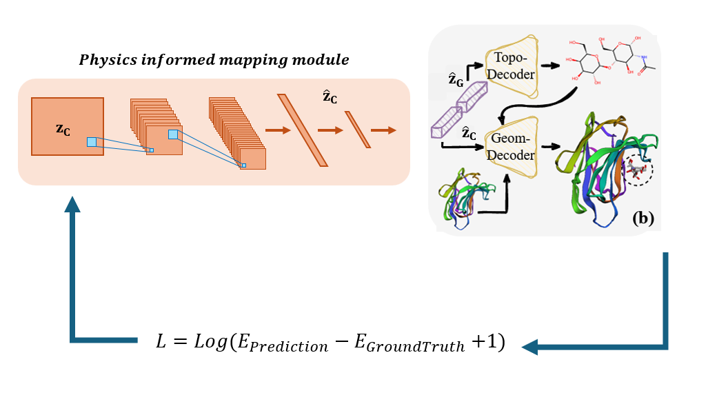
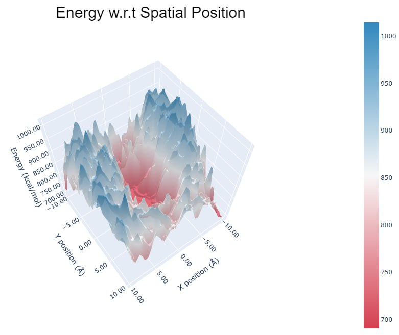

# Energy Basd Latent 3D Graph Diffusion


## Overview
A pipeline to compress 3D graphs into the latent space, where a (vectorial) diffusion model is implemented to capture the distribution.


We added a seperated CNN that gets 3d latents as inputs and manipultates the latents in the way that it can minimize the prediciton energy. 




<!-- ## 2. Conditional Generation on Geometric Object

Download data, trained model weights and generated samples from https://zenodo.org/records/11005227, https://zenodo.org/records/11005419.

You might need the following packages for Vina Docking:
```
pip install meeko==0.1.dev3 scipy pdb2pqr vina==1.2.2 
python -m pip install git+https://github.com/Valdes-Tresanco-MS/AutoDockTools_py3
``` -->

<!-- ### Training Topological AE

```
cd ./AE_Topology

# get vocabulary for molecular graphs
python get_vocab.py --ncpu 40 < ../AE_topo_weights_and_data/smiles_plus.txt > ../AE_topo_weights_and_data/vocab_pocket_aware.txt

# preprocess data for more efficient loading
python preprocess.py --train ../AE_topo_weights_and_data/smiles_mol3d_chembl_train.txt --vocab ../AE_topo_weights_and_data/vocab_pocket_aware.txt --ncpu 40 --mode single --out_path ../AE_topo_weights_and_data/processed_data_pocket_train/
python preprocess.py --train ../AE_topo_weights_and_data/smiles_plus.txt --vocab ../AE_topo_weights_and_data/vocab_pocket_aware.txt --ncpu 40 --mode single --out_path ../AE_topo_weights_and_data/processed_data_pocket/

# train ae
python train_generator_ptl.py  --ddp_num_nodes 1 --ddp_device 1 --train ../AE_topo_weights_and_data/processed_data_pocket_train --vocab ../AE_topo_weights_and_data/vocab_pocket_aware.txt --save_dir ../AE_topo_weights_and_data/pocket_pretrained
# if train ae with gssl
python train_generator_gssl_ptl.py  --ddp_num_nodes 1 --ddp_device 1 --train ../AE_topo_weights_and_data/processed_data_pocket_train --vocab ../AE_topo_weights_and_data/vocab_pocket_aware.txt --save_dir ../AE_topo_weights_and_data/pocket_pretrained_gssl

# generate smiles to emb dictionary
python generate_embedding.py --train ../AE_topo_weights_and_data/processed_data_pocket --vocab ../AE_topo_weights_and_data/vocab_pocket_aware.txt --ckpt ../AE_topo_weights_and_data/pocket_pretrained/last.ckpt --save_fn ../AE_topo_weights_and_data/smiles2emb_dict_pocket.pt
```

### Training Geometric AE
Download data following https://github.com/guanjq/targetdiff#data
```
cd ./AE_Geometry_and_Conditional_Latent_Diffusion

# train ae
python -m scripts.train_ae configs/training.yml

# generate 2d and 3d embeddings
python -m scripts.generate_embedding configs/sampling.yml
```

### Training Diffusion Model
```
cd ./AE_Geometry_and_Conditional_Latent_Diffusion

python -m scripts.train_latent_diffusion configs/training.yml
```

### Sampling and evaluating
```
cd ./AE_Geometry_and_Conditional_Latent_Diffusion

# sample latent embeddings
python -m scripts.sample_z configs/training.yml

# reconstruct 2d
python -m scripts.sample_2d

# reconstruct 3d and evaluate ($data_id in {0, 1, ..., 99})
python -m scripts.sample_3d configs/sampling.yml --data_id $data_id
python -m scripts.evaluate outputs --docking_mode vina_score --protein_root data/test_set --data_id $data_id
``` -->
### Data
 please Download all necessary data as it is provided in the original Latent 3D graph diffusion repository. Please also follow the same package installation steps as well. 

[Latent 3D graph diffusion](https://github.com/Shen-Lab/LDM-3DG)
### Training Energy based Latent 
please go to the folder below
```
AE_Geometry_and_Conditional_Latent_Diffusion
```
and run the ```get_central_energy.ipynb``` notebook for training the energy part.

### Energy spatial Map 
Here is the absolute binding energy based on the displacement of the ligand from ground truth location.
 


### Output files 
the output Pickle file for the enrgy map and our CNN loss is available in the ``` energy_grid.pkl``` and ``` loss_z.pkl``` files.

## Acknowledgements
We wanted to thank Dr. Yang Shen and Yuning You for their invaluable help throughout this project.


