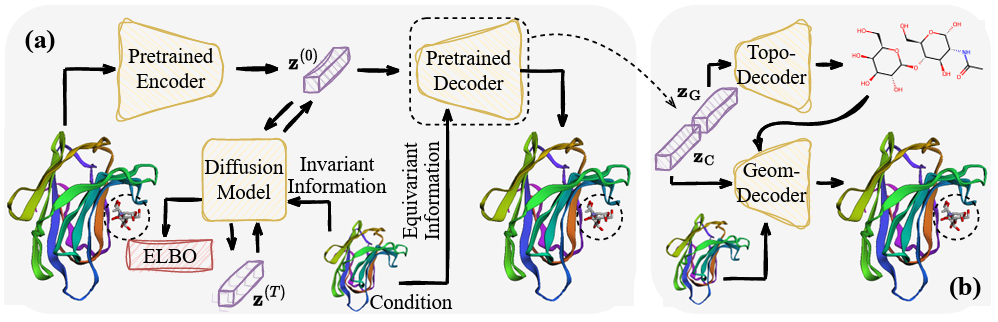
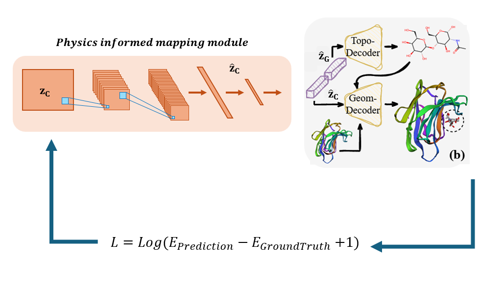
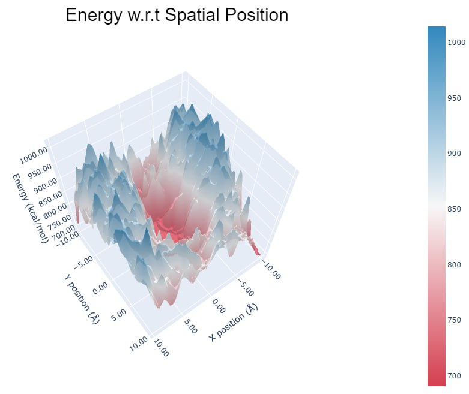

# Energy Basd Latent 3D Graph Diffusion


## Overview
A pipeline to compress 3D graphs into the latent space, where a (vectorial) diffusion model is implemented to capture the distribution.




We added a seperated CNN that gets 3d latents as inputs and manipultates the latents in the way that it can minimize the prediciton energy. 




### Data
 please Download all necessary data as it is provided in the original Latent 3D graph diffusion repository. Please also follow the same package installation steps as well. 

[Latent 3D graph diffusion](https://github.com/Shen-Lab/LDM-3DG)
### Training Energy based Latent 
please go to the folder below
```
AE_Geometry_and_Conditional_Latent_Diffusion
```
and run the ```get_central_energy.ipynb``` notebook for training the energy part.

### Energy spatial Map 
Here is the absolute binding energy based on the displacement of the ligand from ground truth location.
 


### Output files 
the output Pickle file for the enrgy map and our CNN loss is available in the ``` ./data/energy_grid.pkl``` and ``` ./data/loss_z.pkl``` files.


## Acknowledgements
We wanted to thank Dr. Yang Shen and Yuning You for their invaluable help throughout this project.


